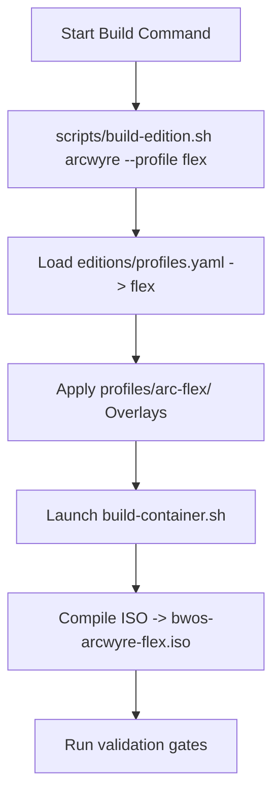

# Arcwyre Flex Profile Activation Plan

This activation plan details how the staged **Arcwyre Flex** profile becomes officially integrated and selectable within the **PhoenixCore** build system.

---

## 1. Current Build System Audit

- **Edition Definitions**: Editions are defined under `editions/` with an `edition.yaml` manifest specifying colors, branding paths, package lists, and ISO targets.
- **Profiles Definition**: Hardware targets (e.g., Chromebook, Apple Silicon) are declared in `editions/profiles.yaml` and injected during builds using `--profile=<profile-id>`.
- **Primary Build Engine**: `scripts/build-edition.sh` parses `edition.yaml`, patches configurations, sets environment variables, and launches the container builder (`os/phoenix-os/container/build-container.sh`), which in turn calls `build-iso.sh`.

---

## 2. Proposed Build Command Shape

To activate the **Flex** profile configuration under the Arcwyre operating system umbrella, we will structure the command as:

```bash
./scripts/build-edition.sh arcwyre --profile flex
```

### Build CLI Configuration
This leverages the existing script logic. We will append the `flex` profile definition directly into `editions/profiles.yaml` to configure target overrides:

```yaml
  flex:
    name: "Arcwyre Flex Lightweight"
    arch: "amd64"
    bootloader: "grub-efi-x64"
    kernel_args: "quiet splash console=tty0"
    profile_overlay: "os/phoenix-os/profiles/arc-flex"
```

---

## 3. Staged File Integration

During staging validation, files are mapped to the active OCI build staging area (`os/phoenix-os/cache/edition-staging`) before compilation:

```
[Source: os/phoenix-os/profiles/arc-flex/]
├── package-lists/base-packages.txt                 → Staged as edition.list.chroot
├── base/disabled-services.txt                      → Staged to includes.chroot/etc/systemd/system/
├── includes.chroot/etc/skel/.config/xfce4/panel/   → Staged to includes.chroot/etc/skel/
├── branding/arcwyre-flex.svg                       → Staged as logo/brand overlays
└── modes/                                          → Staged into includes.chroot/etc/arcwyre/modes/
```

---

## 4. Output Artifact Naming

The synthesis output artifact generated under `os/phoenix-os/build/` is defined as:

`bwos-arcwyre-flex.iso`

---

## 5. Verification & Validation Gates

To ensure the build executes cleanly without introducing drift, the following validation gates are configured:

1. **Compilation Success**: The OCI builder container finishes execution with an exit code of `0`.
2. **Boot Verification**: The built `bwos-arcwyre-flex.iso` successfully loads into a QEMU test environment.
3. **Desktop Launch**: LightDM starts X11 and initializes the XFCE desktop.
4. **Performance Gate**:
   - Idle RAM usage is measured under **250 MB**.
   - Storage footprint of the compiled filesystem is under **3 GB**.
5. **Shortcut Integrity**:
   - Thunar (File Manager), Mousepad (Text Editor), and Firefox launch correctly.
   - **No fake app launchers or placeholder icons** are baked into the desktop layout.

---

## 6. Activation Execution Path



**Status**: `ARCWYRE_FLEX_ACTIVATION_PLANNED`
