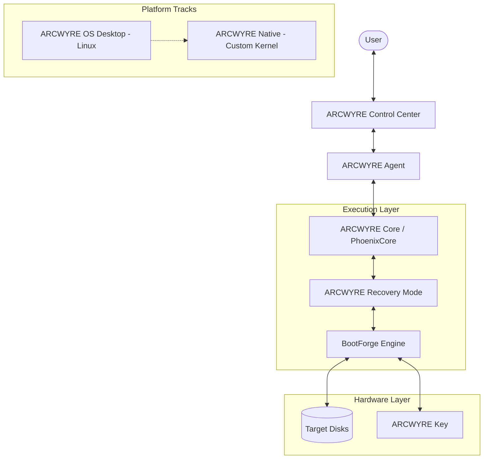

# ARCWYRE OS Platform Architecture

This document outlines the high-level architecture of the ARCWYRE OS ecosystem, a recovery-first, sovereign operating-system platform.

## 1. System Overview

ARCWYRE OS is designed as a multi-tier platform that transitions from a practical, Linux-based desktop environment to a fully independent, from-scratch native OS.

### The Two Tracks

1.  **ARCWYRE OS Desktop**: The "Public Shipping" edition. Built on a hardened Linux foundation (Debian/AOSP-based), it provides immediate hardware compatibility and a robust recovery environment.
2.  **ARCWYRE Native**: The "Sovereign" branch. A clean-slate OS built on the custom **ARCWYRE Kernel**, designed for maximum security, auditability, and independence.

---

## 2. High-Level Architecture Diagram

---

## 3. Core Components

### ARCWYRE Control Center
The primary user interface for system management, diagnostics, and recovery. Built as a high-integrity web application (React/Tauri) designed to run both as a desktop app and in the recovery environment.

### ARCWYRE Agent
A privileged bridge service (Rust) that orchestrates communication between the Control Center UI and the low-level Core services. It enforces safety boundaries and validates all hardware-level operations.

### ARCWYRE Core (PhoenixCore)
The shared runtime engine and service layer. It contains the cross-platform Rust crates for safety, imaging, and hardware discovery that power both the Desktop and Native tracks.

### BootForge Engine
The existing high-performance imaging engine. It handles the low-level "Cold Fuse" imaging process, creating bootable installers for Windows, Linux, and macOS.

### ARCWYRE Recovery Mode
The dedicated recovery mode environment. When triggered, the system enters a minimal, hardened state (Recovery Mode) where the Control Center performs deep system repair and imaging tasks.

### ARCWYRE Key
The hardware-backed identity and recovery device. It stores the system's "Sacred Truth" (backup keys, recovery images, and identity markers).

---

## 4. Recovery Spine Model

The system is built around a **Recovery Spine**: every component is designed with a "Repair-First" mentality.
- **Diagnostics**: Real-time monitoring via StormGrid.
- **Auditability**: All hardware operations are logged and verified.
- **Immutability**: Core OS components are protected via signed volumes and read-only partitions where possible.

---

## 5. Migration Path: Desktop to Native

The long-term goal is the "Great Bridge":
1.  **Phase 1**: Desktop (Linux) hosts the development and testing of Native components.
2.  **Phase 2**: Native kernel (ARCWYRE Kernel) begins handling non-critical system tasks in parallel.
3.  **Phase 3**: System transition—the Linux foundation is reduced to a compatibility layer for legacy apps, with ARCWYRE Native taking over the primary execution spine.
