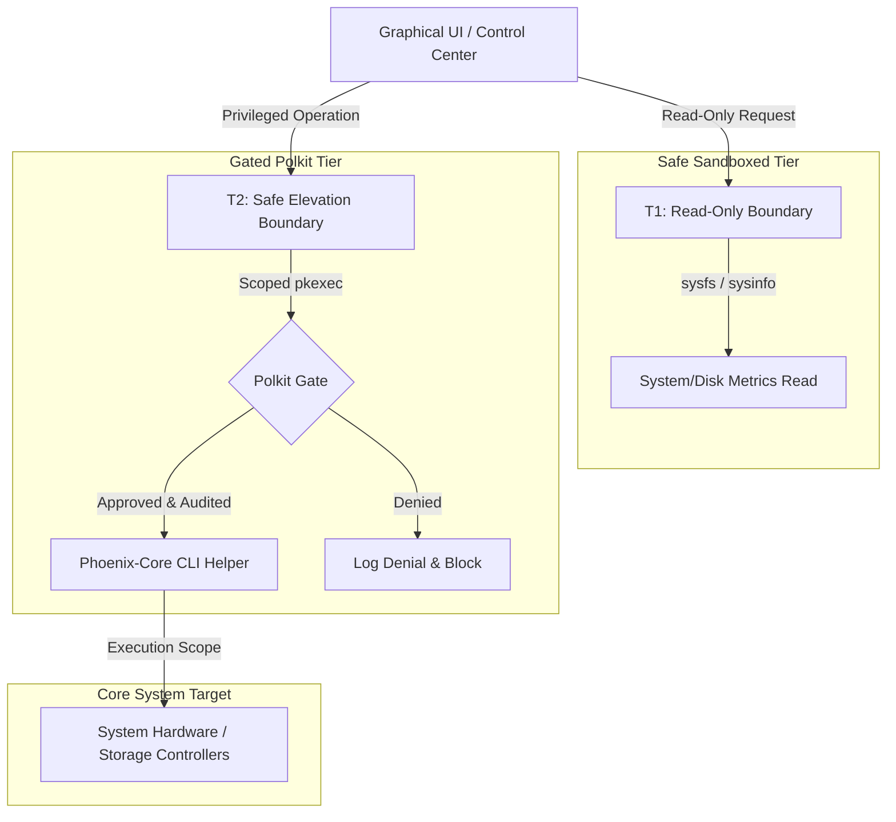

# Phoenix OS Governed Execution Model

This document defines the safe execution boundaries, authorization tiers, and security policies governing application capability inside the **Bobby's Worldwide OS (BWOS) / Blue Phoenix OS** ecosystem.

---

## 🛡️ Core Security Architecture

To prevent destructive bare-metal occurrences, unauthorized operations are governed by a strict four-tiered **Execution Boundary Framework**. Applications are forbidden from directly executing low-level disk or system operations from user space.

---

## 🎚️ Application Operation Classification

All operations are grouped into four structural authorization classes:

### 1. Read-Only Operations (Allowed)
These operations perform zero mutation and pose no risk to target hardware. They are allowed freely by the user interface:
* Read-only hardware inventory scanning.
* SMART telemetry reads and NVMe status reporting.
* Non-destructive disk partition layout scanning.
* Thermal, battery, and fan speed metrics tracking.
* Network interface diagnostic ping / trace.

### 2. Preview & Simulation Operations (Allowed & Labeled)
Safe visual simulations designed to demonstrate system behaviors without actual device mutation:
* Safe dry-run partition layout mock-ups.
* Boot loader menu configurations mock rendering.
* System recovery walkthrough dry-runs.
* **Condition:** Must explicitly display a clear, permanent `[SIMULATION MODE]` or `[PREVIEW-ONLY]` visual label on the active screen.

### 3. Gated Operations (Gated by Scoped Polkit Gates)
Higher-risk operations that are strictly blocked by default, requiring targeted user authentication:
* Dynamic serial heartbeat adjustments.
* Audit log purging.
* Config includes overlays refreshes.
* **Condition:** Triggered via unique Polkit policies utilizing fine-grained `pkexec` wrappers that run dedicated, audited CLI helper scripts rather than standard bash prompts.

### 4. Blocked Operations (Strictly Blocked / Denied)
Extremely hazardous low-level operations. These are completely disabled and blocked from release ISO launchers:
* Unattended disk formatting/wiping.
* Low-level block-level partitioning.
* EFI/firmware mutation outside audited release channels.
* Automated destructive repair algorithms.
