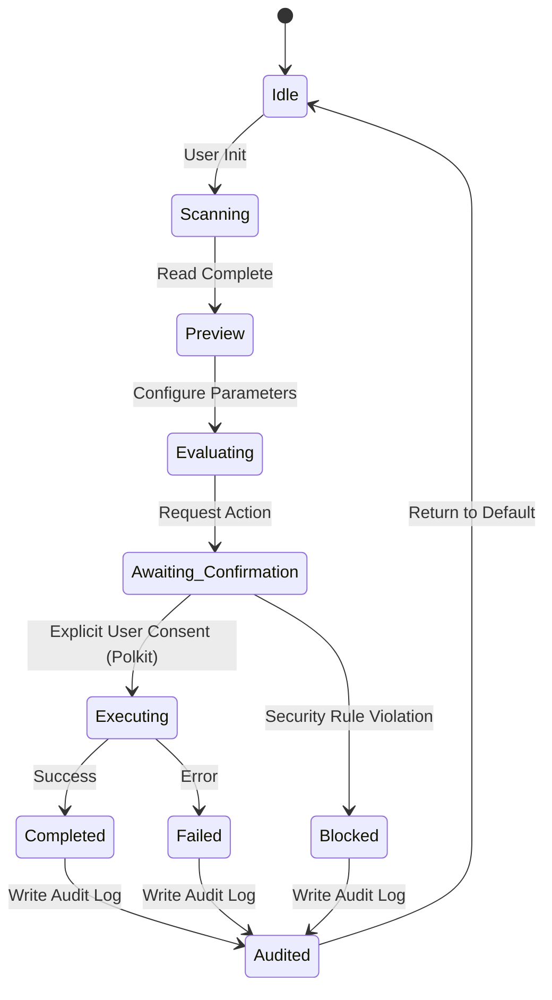

# Phoenix OS Operation State Machine

This document details the canonical lifecycle, transitional rules, and state parameters governing all application workflows within the **Phoenix OS / BWOS** platform.

---

## 🌀 Canonical Workflow Lifecycle

To guarantee truthfulness and prevent silent executions, every low-level utility must strictly traverse the following state sequence. No shortcuts or state bypasses are permitted.

---

## 📋 State Definitions

| State | Scope | Description | Forbidden Shortcuts |
|---|---|---|---|
| **`Idle`** | Neutral | Default resting state; application waits for user interaction. | N/A |
| **`Scanning`** | Read-Only | Actively probing hardware or config states (e.g. searching disk channels). | Cannot skip scanning directly to Executing. |
| **`Preview`** | Safe Display | Renders non-destructive target metrics or layout layouts visually to the operator. | Cannot perform actual write operations. |
| **`Evaluating`** | Logic Gate | Software validates target requirements and tests security compliance rules. | Must not evaluate permissions silently. |
| **`Awaiting_Confirmation`**| User Decision| Halts execution and presents a standard, explicit confirmation dialog containing the planned impact checklist. | No automatic confirmations or silent defaults. |
| **`Executing`** | Privileged | System prompts user via Polkit and executes the scoped operation through an audited helper. | Bypassing Polkit prompt is blocked. |
| **`Completed`** | Result | Action completes with a truthful status update and clean process termination. | Must not show "Completed" if errors occurred. |
| **`Blocked`** | Safety | Safety boundaries or policy engines reject the execution command due to compliance limits. | N/A |
| **`Failed`** | Error | Action fails cleanly; logs descriptive system codes without compromising security. | Must not hide error codes. |
| **`Audited`** | Verification | System registers a secure, immutable cryptographic log record describing the lifecycle trace. | Log step must never be bypassed. |

---

## 🚫 Forbidden Transitional Shortcuts

1. **`Idle` ➔ `Executing`:** Strictly prohibited. An application must always perform initial scanning, present a non-destructive visual preview, evaluate target limits, and prompt for explicit confirmation before triggering privileged execution.
2. **`Awaiting_Confirmation` ➔ `Completed`:** Illegal. No mock success labels or fake execution loops may bypass the physical execution layer.
3. **`Executing` ➔ `Completed` (Without Audit):** Blocked. An execution trace that fails to sign the secure audit log is considered invalid and must force a system alert.
