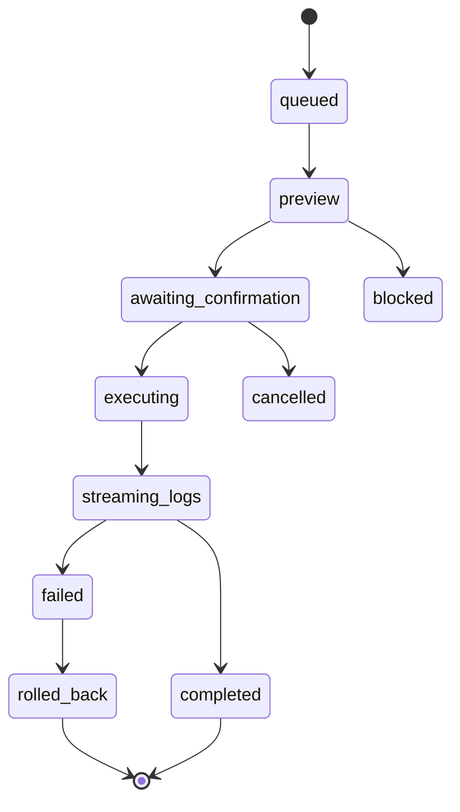

# Phoenix Operation State Machine

All operations must transition through these states.

## Canonical States
- `queued`: Request received, awaiting processing.
- `preview`: Generating impact report.
- `blocked`: Policy evaluation failed.
- `awaiting_confirmation`: Awaiting user `PHX-TOKEN` or manual sign-off.
- `executing`: Operation in progress.
- `streaming_logs`: Active log output available.
- `completed`: Success.
- `failed`: Terminal error.
- `rolled_back`: Operation failed and changes were reverted.
- `cancelled`: Aborted by user before execution.

## Valid Transitions

