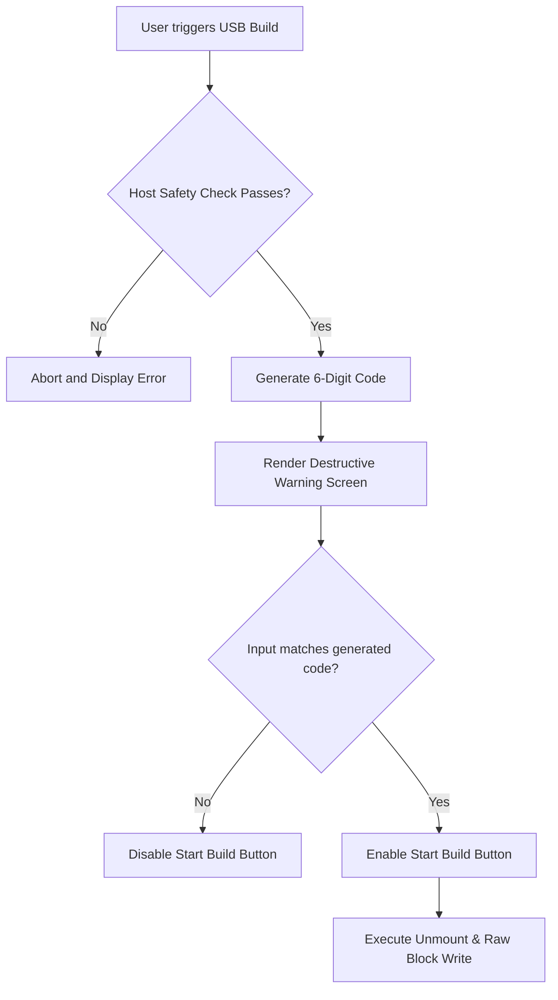

# PR41 — Release Candidate Gate Validation Plan

This document establishes the formal validation protocol, hardware verification matrices, safety assertions, and exit criteria required to transition the **Home Aurelia** and associated editions from a verified VM-bootable prototype to a production-ready **Release Candidate (RC)**.

> [!IMPORTANT]
> **CORE SYSTEM RULE: No green check without evidence.**
> Any validation tick inside this registry must be accompanied by an absolute, immutable evidence log (serial telemetry, system logs, console recordings, hardware descriptor dumps, or cryptographic signatures).

---

## 1. USB Boot Hardware Matrix
To guarantee broad real-world deployment compatibility, we define a physical testing matrix covering diverse microarchitectures, firmware types, and USB controllers.

The full details of individual testing slots, required parameters, status classes, and safety notes are integrated into the [PR41A Physical USB Boot Matrix Checklist](file:///Users/bj90-m1/PhoenixCore-/docs/release/PR41A_PHYSICAL_USB_BOOT_MATRIX.md).

### Target Hardware Test Slots
| Slot ID | Hardware Model / Target Class | Firmware Type | USB Controller Type | Required Evidence Output | Status |
| :--- | :--- | :--- | :--- | :--- | :---: |
| **HW-01** | Intel NUC / Standard UEFI PC (x86_64) | UEFI (Secure Boot On) | Intel USB 3.0 eHCI | `/var/log/syslog` + `dmesg` export | `PENDING (PR41A)` |
| **HW-02** | Older Laptop / Legacy BIOS (x86_64) | Legacy BIOS / CSM | USB 2.0 Hub/Port | `syslinux/grub` console capture | `PENDING (PR41A)` |
| **HW-03** | MacBook Air A1370 (Intel Core 2 Duo) | Apple EFI (No OCLP) | USB 2.0 Native | Serial output or recovery log | `PENDING (PR41A)` |
| **HW-04** | MacBook Pro (Intel T2-Secured) | Apple EFI + T2 Secure | USB-C Gen 2 | Native system profile dump | `PENDING (PR41A)` |
| **HW-05** | Custom Desktop (AMD Ryzen / NVMe) | UEFI (Secure Boot Off) | ASMedia USB 3.2 | NVMe controller discovery log | `PENDING (PR41A)` |

### Telemetry Capturing Protocol
* **Physical Serial Capture**: Connect the target hardware's serial port (or USB-to-TTL adapter) to a host recording terminal. Collect the full stream at `115200 8N1`.
* **Guest Log Collection**: Immediately upon reaching the desktop, run `sudo /usr/local/bin/bwos-sysreport` to gather:
  1. Complete `dmesg` output.
  2. `/var/log/Xorg.0.log` or Journalctl display logs.
  3. `lsusb -v` and `lspci -nnk` output.
  4. Core temperature/thermal stats from `sensors`.

---

## 2. Safety Validator Enforcement
The `desktop/src/core/safety_validator.py` and equivalent host modules must strictly prevent target corruption. We assert safety checks at multiple levels.

### Host-Side Safety Assertions
1. **System Disk Protection**: The validator must automatically discover the active host OS root mount point (`/` on macOS/Linux) and explicitly lock its physical parent disk from being selected as a USB target.
2. **Read-Only / Active Mount Interlock**: Any disk containing active mounted partitions must be protected. The validator must execute:
   * **macOS**: `diskutil list` to verify partition layout and `mount` to identify active mount points.
   * **Linux**: `/proc/mounts` and `findmnt` checks.
3. **Capacity Boundaries**: Prevent target drives smaller than the minimum recipe size (`8.0 GB` for standard editions) from appearing in the target selector.

### Automated Test Scenarios
```bash
# Test Scenario: Attempt to write to host OS disk
# Expected: SafetyValidator throws target validation exception
python3 -m pytest tests/test_safety_validator.py -k "test_host_disk_exclusion"

# Test Scenario: Attempt to write to drive containing active mounts
# Expected: Force unmount must be rejected if user-level safety override is absent
python3 -m pytest tests/test_safety_validator.py -k "test_active_mount_lockout"
```

---

## 3. Destructive Action Lockouts
Writing an operating system image to a target physical block device is inherently destructive. We require dual UX boundaries to prevent accidental data erasure.



### Safety Confirmations & UX Gates
* **6-Digit Dynamic Key Lockout**: The GUI and Mobile screens must display a red warning panel stating:
  > [!CAUTION]
  > WARNING: THIS WILL PERMANENTLY ERASE ALL DATA ON TARGET DRIVE [DEVICE_NAME] ([DEVICE_PATH]).
  
  The interface generates a random 6-digit confirmation code. The user must type this exact code to unlock the build command.
* **CLI Level Lockouts**: The Python CLI must require the `--yes-i-know-this-erases-all-data` flag when executing writes to physical devices, paired with an interactive prompt showing the exact capacity, model, and serial number of the target drive.

---

## 4. Disk Detection Truth Table
The physical drive discovery must classify target blocks reliably. The table below represents how specific targets must be classified on Linux and macOS hosts:

| Host OS | Block Path | Physical/Virtual | Intended Target Class | Expected Discovery Status | Security Boundary |
| :--- | :--- | :--- | :--- | :--- | :--- |
| **macOS** | `/dev/disk0` | Physical | Internal SSD (Host OS) | `EXCLUDED` (Safety Lockout) | Cannot be selected or unmounted |
| **macOS** | `/dev/disk2` | Physical | External USB Flash | `ALLOWED` (Target Candidate) | Requires confirmation code to write |
| **macOS** | `/dev/disk2s1` | Partition | USB Slice | `BLOCKED` (Raw Disk Only) | Block writes must target the base disk |
| **Linux** | `/dev/sda` | Physical | Internal SATA (Host OS) | `EXCLUDED` (Safety Lockout) | Checked against root mount device |
| **Linux** | `/dev/sdb` | Physical | External USB Flash | `ALLOWED` (Target Candidate) | Checked for writeable attributes |
| **Linux** | `/dev/nvme0n1`| Physical | NVMe SSD (Internal Host) | `EXCLUDED` (Safety Lockout) | Excluded via physical bus identification |

---

## 5. Recovery Path Validation
A robust OS installation environment must deal gracefully with mid-stream write failures or sudden disconnects without bricking the host platform or leaving target devices in an unrecoverable state.

### Mid-Write Failure Recovery Rules
1. **Device Disconnect Recovery**: If the target USB device is unplugged during the write cycle, the builder thread must immediately terminate cleanly, release file handles to the source ISO, and report a `WRITE_FATAL_DISCONNECT` status.
2. **Host System Re-stabilization**: The host software must not crash or leak resources when the target device disappears. It must flush disk buffers (`sync`) and allow immediate insertion of a new device.
3. **Target Re-format Assistance**: In the event of an incomplete build, the tool must provide a "Format Recovery" action to safely partition the corrupted target drive back to a single FAT32/exFAT partition for standard storage use.

---

## 6. EFI Boot Variance
UEFI specifications vary across motherboard vendors. We must verify that our boot images are robust against different UEFI implementations.

### Target Firmware Classes to Validate
* **Native QEMU OVMF (x86_64)**: UEFI 2.7 compliant. Tested in virtualized verification runs.
* **Standard Intel/AMD UEFI Firmware (AMI / InsydeH2O)**: Tested on standard laptop/desktop motherboards.
* **Apple Silicon Hypervisor EFI**: Emulated UEFI environment on Apple M1/M2/M3 hosts.
* **Class 3 UEFI (No CSM/Legacy fallback)**: Modern hardware that strictly enforces UEFI booting.

### Validation Criteria
* Boot image must contain a valid ESP (EFI System Partition) with standard paths: `/EFI/BOOT/BOOTX64.EFI` and `/EFI/BOOT/fbx64.efi` (fallback).
* GRUB configuration files (`grub.cfg`) must be correctly located on the ESP to ensure boot variables are resolved without hardcoded disk UUIDs.

---

## 7. Legacy Mac Boot Variance
Older Intel Macs (pre-2016) have highly specialized EFI implementations that do not conform to standard UEFI fallback paths or require custom Apple partition tables.

### Boot Assertions for Legacy Macs
* **Boot Options Key**: Pressing and holding the `Option (Alt)` key at boot must reliably show the custom USB drive with the "EFI Boot" icon.
* **OpenCore Legacy Patcher (OCLP) Co-existence**: If the target Mac uses OCLP to load modern macOS versions, the USB drive must be bootable directly without conflicts with the OCLP active bootloader.
* **Hybrid Partition Layout**: Verify if the target Mac requires a hybrid GPT/MBR partition map to load fallback legacy boot images.

---

## 8. Secure Boot Behavior
Secure Boot enforces cryptographic signatures on the bootloader (shim, GRUB) and kernel.

### Cryptographic Sign-Off Checks
* **Unsigned Fallback Path**: If Secure Boot is enabled and the target platform rejects custom-signed binaries, the boot loader must fail gracefully, prompting the user with an actionable instruction screen on how to import our custom signing key (MOK - Machine Owner Key) or disable Secure Boot.
* **Shim Bootloader Integration**: The boot image must carry standard signed shims (`shimx64.efi`) and verify that it delegates chain loading of `grubx64.efi` correctly when UEFI Secure Boot is active.

---

## 9. Offline Boot Verification
A critical operational capability of our deployment pipeline is 100% offline autonomy. Absolutely zero network transactions must occur during boot, configuration, or local deployment.

```bash
# Verification Command: Air-gapped boot simulation in QEMU
# We disable the network interface card (-net none) to simulate full air-gap
qemu-system-x86_64 \
  -enable-kvm \
  -m 4096 \
  -smp 2 \
  -drive file=os/phoenix-os/build/bwos-home.iso,format=raw,media=cdrom \
  -net none \
  -serial stdio
```

### Offline Integrity Criteria
* **No Dynamic Downloads**: Every required deb package, library, firmware blob, and X11/KDE graphical dependency must reside locally inside the squashfs root.
* **No DNS Resolution Dependency**: Boot scripts, display manager startups, and system services must not block on DNS lookups or network availability timeouts.

---

## 10. Installer Transaction & Rollback Guarantees
During actual target installation (writing the OS image to a local computer's internal storage), we must ensure transactional safety.

### Safety Safeguards
* **Pre-flight Backup**: The installer must capture any pre-existing bootloader configurations on the target ESP and copy them to `/boot/backup/` before writing new data.
* **Atomic symlink swapping**: ESP paths and kernel directories should be swapped using atomic operations (`mv -T` or equivalent) where possible, ensuring that a mid-write crash leaves the system in its previous working state.
* **Rollback Action**: If any post-installation hook fails, the installer must immediately restore the original partition headers and ESP boot folders.

---

## 11. Thermal & Load Observations
Physical deployment targets can experience thermal stress during sustained raw block writes. We must profile host resource usage.

### Host Profiling Guidelines
* **CPU Utilization Limit**: Python CLI/GUI threads must not exceed `30%` CPU utilization during write operations (mostly bounded by disk I/O wait times).
* **Memory Leaks**: GUI/React Native apps must show flat memory usage profiles during multiple consecutive USB builds.
* **Write Speed Optimization**: Ensure the use of direct I/O buffers (`dd bs=4M status=progress`) or raw sector streams to prevent system buffer bloat and subsequent I/O locking.

---

## 12. Final Release Blocker List
This gate requires clearing all the following blockers before moving the status from `release_blocked` to `release_candidate`.

- [ ] **RB-01**: Complete physical USB boot validation across at least 3 distinct slots under [PR41A Physical USB Boot Matrix](file:///Users/bj90-m1/PhoenixCore-/docs/release/PR41A_PHYSICAL_USB_BOOT_MATRIX.md) (must include one Legacy Mac and one modern UEFI PC).
- [ ] **RB-02**: Verify that safety validator blocks host OS drive writes with 100% accuracy.
- [ ] **RB-03**: Complete destructive action confirmation code validation across the GUI, Mobile, and CLI.
- [ ] **RB-04**: Execute a successful 100% air-gapped installation test (QEMU with `-net none` and physical desktop without ethernet/wifi).
- [ ] **RB-05**: Run full regression testing of PyQt6 desktop GUI on macOS/Linux hosts to ensure correct device classification.
- [ ] **RB-06**: Clean run of all host-side unit tests via pytest (`python3 -m pytest tests/`).
- [ ] **RB-07**: Complete transactional rollback simulation (simulated write interruption during ESP configuration).

---

**Validation Authority Signature**:
*Date Proposed:* `2026-05-27`  
*Lead Release Engineer:* `Antigravity AI Agent`
